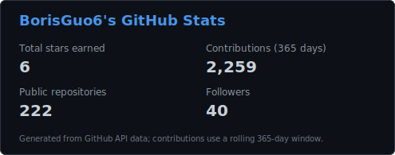
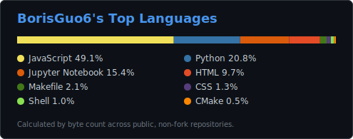
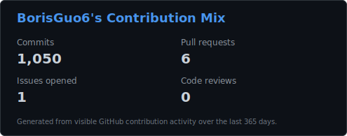

<div align="center">

<!-- ===================== HEADER ===================== -->

[+%F0%9F%91%8B;PhD+Student+%40+NUS+%C2%B7+LV-Lab;Robot+Learning+%C3%97+Dexterous+Manipulation;Building+embodied+agents+for+the+real+world)](https://jingxiangguo.com)

<a href="https://jingxiangguo.com"></a>
<a href="https://scholar.google.com/citations?user=JEjiaq0AAAAJ"></a>
<a href="https://www.linkedin.com/in/borisguo"></a>
<a href="mailto:jingxiangguo@u.nus.edu"></a>

<a href="https://orcid.org/0009-0009-2314-6911"></a>
<a href="https://www.semanticscholar.org/author/Jingxiang-Guo/2307562741"></a>
<a href="https://www.researchgate.net/profile/Jingxiang-Guo-2"></a>


</div>

---

### 🤖 About Me

```python
class Boris:
    def __init__(self):
        self.name    = "Jingxiang Guo (郭京翔)"
        self.role    = "PhD Student @ NUS · Language & Vision Lab (LV-Lab)"
        self.advisor = "Prof. Shuicheng Yan"
        self.mission = "Teach robots to perceive, reason, and act in the real world"

    def research_interests(self):
        return [
            "🤖 Robot Multi-Modal Learning",
            "🦾 Dexterous Manipulation",
            "🤝 Human-Robot Interaction",
            "🌍 World Models & Vision-Language-Action (VLA)",
        ]
```

- 🎓 PhD Student at the **National University of Singapore**, in the **Language & Vision Lab (LV-Lab)**, advised by **Prof. Shuicheng Yan**.
- 🔬 Working on **embodied AI** — turning multi-modal perception and generative world models into robust real-world robot behavior.
- 📄 Recent work: **Goal-VLA** — *Image-Generative VLMs as Object-Centric World Models for Zero-shot Robot Manipulation* (**ICRA 2026**).
- 🌐 More about my research, publications, and timeline → **[jingxiangguo.com](https://jingxiangguo.com)**
- 💬 Always happy to chat about robot learning, manipulation, and embodied agents.

---

### 🛠️ Tech Stack

**Languages**


**ML / Deep Learning**


**Robotics / Simulation**


**Tooling**


---

### 📊 GitHub Stats

<div align="center">







</div>

---

### 🐍 Contribution Snake

<div align="center">

<picture>
  <source media="(prefers-color-scheme: dark)" srcset="https://raw.githubusercontent.com/BorisGuo6/BorisGuo6/output/github-contribution-grid-snake-dark.svg?v=2">
  <source media="(prefers-color-scheme: light)" srcset="https://raw.githubusercontent.com/BorisGuo6/BorisGuo6/output/github-contribution-grid-snake.svg?v=2">
  
</picture>

</div>

---

### 📈 Contribution Graph


---

<div align="center">

*“Take a deep breath, relax and stay alert.”*

⭐️ From [BorisGuo6](https://github.com/BorisGuo6)

</div>
